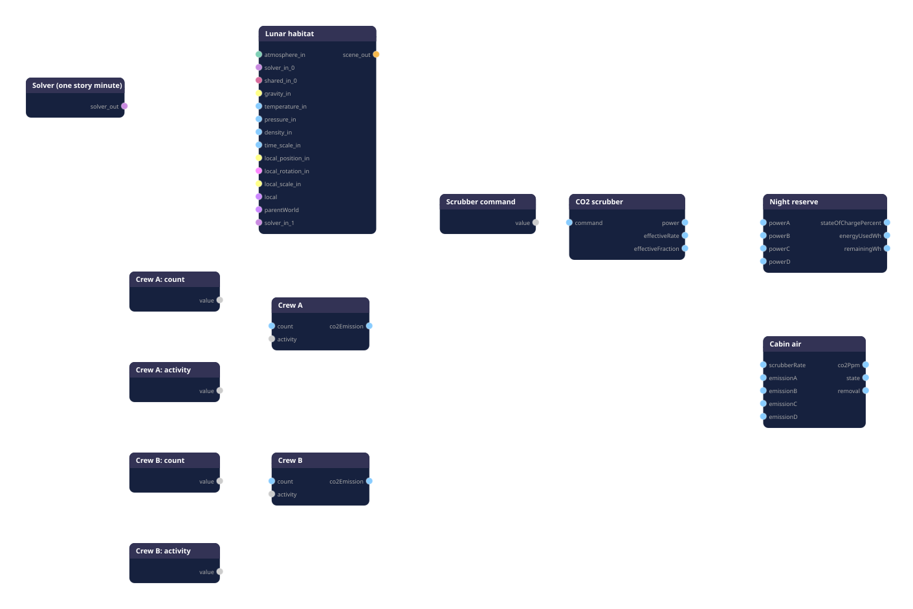

# The cabin twin graph: nodes, wiring, computations

`graphs/cabin.spikypanda` is the digital twin of the habitat's cabin: the
physics graph the agent asks its questions to (slot `twin`), the oracle the
factory's jobs run, and the document the node editor shows. It is built by
`npm run twin:build` from two reviewable files, never by hand: the constants
come from `specs/cabin-parameters.json`, the schedule and the starting state
from `specs/scenario-night-9.json`. Its manifest, `graphs/cabin.manifest.json`,
records the sha256 of both. The model itself is explained in
`docs/cabin-model.md`; this page is the graph.



*Exported from the node editor on 19 September 2026, as is (dark skin,
transparent background): the layout made there, with every port.
`npm run twin:draw` produces a plainer picture from the document,
`docs/cabin-graph.headless.svg`, when no editor is at hand.*

## 1. Reading the graph

Twelve nodes, ten connections, four kinds:

- **the frame**: the scene and its solver (top left);
- **the schedule**: five timelines, piecewise-constant sources (the left column and the scrubber command);
- **the physics**: two crew groups, the scrubber, the cabin air;
- **the energy**: the battery (the night reserve, top right).

Signals flow left to right. The timelines feed the crews and the scrubber;
the crews feed the cabin; the scrubber feeds the cabin (its rate) and the
battery (its power). There is no loop: the cabin computes the CO2 removal
from its own integrated state and the scrubber's rate, so nothing has to be
fed back. The solver integrates the three states (the scrubber's lagged
rate, the cabin's CO2, the battery's energy) between ticks; every other node
is a pure function of what it reads.

Time: the session runs in seconds; one story minute is sixty seconds of
simulation; the solver's step is one story minute; the nodes' constants are
expressed per minute and converted inside their equations.

## 2. The nodes

### Lunar habitat (`Physics.Scene:moon`)

The root of the document: the ambient context every node under it may read
(gravity 1.625 m/s2 downward, temperature, pressure) and the owner of the
solver. It computes nothing for the cabin; it is what makes the document a
simulation rather than a diagram, and it is where the editor and the
factory attach the solver.

### Solver (one story minute) (`Control.Sim:rk4-solver`)

The integration method for the three states: Runge-Kutta 4(5) with adaptive
micro-steps (Cash-Karp), tolerance 1e-6, maximum step 60 s. Wired into the
scene's `solver_in_0` as a configuration link (dashed). Without it the
registry's default (a 0.01 s maximum step) would integrate the same
equations correctly but three thousand times slower.

### Crew A: count, Crew A: activity, Crew B: count, Crew B: activity, Scrubber command (`Logic.Time:timeline`)

Piecewise-constant sources. Each holds a list of segments
`{ from, to, value }` in session seconds and publishes, on every tick, the
value of the segment that contains the current time (`defaultValue`
outside every segment). The four crew timelines carry the scenario's
schedule, in two groups (night 9: four asleep until minute 200, then two
asleep and two exercising, then two resting and two exercising, then four
at light work); the fifth holds the scrubber command (0 to 1, the board's
speed percent divided by 100), constant at 33 % in the document and
rewritten by the jobs and the twin slot for each question.

### Crew A, Crew B (`Physics.LifeSupport:crew`)

The CO2 sources. Each reads a head count and an activity and publishes the
group's emission:

```
co2Emission = count * emissionPerPerson[activity]        [ppm/min]
```

with, per person and per minute: sleep 2.0, rest 3.5, light work 5.5,
heavy work 7.0 ppm (the parameter file's `crew.emissionPerPerson`). A
person's CO2 output follows the metabolic level; in a sealed, well-mixed
volume that mass rate is a concentration rate once divided by the volume,
which these figures already include. No state.

### CO2 scrubber (`Physics.LifeSupport:scrubber`)

The sink's dynamics and its power. One integrated state, the effective
removal rate, which follows the command with a lag (chemical activation and
gas transport take minutes):

```
target       = rateAtFullCommandPerMinute * command          [1/min]
d(rate)/dt   = (target - rate) / lagTimeConstantMinutes
```

with `rateAtFullCommandPerMinute` 0.05 (the "normal" preset) and a time
constant of 3.33 minutes. It publishes `effectiveRate` (1/min),
`effectiveFraction` (rate over the full-command rate) and `power`:

```
power = supplyVolts * (interceptAmps + slopeAmps * command) * habitatScale   [W]
```

The current line (0.0879 A + 0.1611 A per unit of command) is the one the
factory's `fit` job measured on the bench motor; the supply is 6 V; the
habitat scale (300) turns bench watts into habitat watts. At 33 % command
the scrubber draws 254 W.

### Cabin air (`Physics.LifeSupport:cabin-air`)

The balance of CO2 in the well-mixed volume, one integrated state:

```
removal      = scrubberRate * max(co2Ppm - removalFloorPpm, 0)                       [ppm/min]
d(co2Ppm)/dt = emissionA + emissionB + emissionC + emissionD - removal - leakPerMinute * co2Ppm
```

clamped to [300, 10000] ppm. The absorbent removes in proportion to the
excess above 400 ppm (it works on the partial pressure) and to the
scrubber's rate; the leak loses 0.1 % of the CO2 per minute. The node also
publishes the state the life-support rules read: NOMINAL below 3500 ppm,
ELEVATED from 3500, CRITICAL from 4000 (the parameter file's
`thresholds`, which the device's contract will carry). Starts at the
scenario's 1500 ppm.

Steady state for a constant crew emission `e` and rate `r`:
`co2Ppm = (e + r * 400) / (r + 0.001)`. Four people resting at 40 % settle
at 1048 ppm; that is how the minimum-flow floor is read.

### Night reserve (`Physics.Electric:battery`)

The energy budget, one integrated state:

```
d(energyUsedWh)/dt   = (powerA + otherLoadsW) / 3600          [Wh per second]
stateOfChargePercent = 100 * (initial Wh - energyUsedWh) / capacityWh
```

Capacity 40 kWh, 41 % at the start of night 9, other loads 900 W held
constant; the scrubber's power is the only wired load. Over the eight
hours of the scenario at 33 %, the reserve goes from 41 % to 17.9 %.

## 3. The wiring

| From | To | What travels |
|---|---|---|
| Solver.solver_out | Lunar habitat.solver_in_0 | a configuration link: which solver integrates the scene's leaves |
| Crew A: count.value | Crew A.count | head count |
| Crew A: activity.value | Crew A.activity | activity name |
| Crew B: count.value, Crew B: activity.value | Crew B.count, Crew B.activity | idem |
| Crew A.co2Emission, Crew B.co2Emission | Cabin air.emissionA, emissionB | ppm/min each (C and D are free for two more groups) |
| Scrubber command.value | CO2 scrubber.command | 0 to 1 |
| CO2 scrubber.effectiveRate | Cabin air.scrubberRate | 1/min |
| CO2 scrubber.power | Night reserve.powerA | W |

All data links are signals: a reader takes the latest value, nothing is
queued, and the solver snapshots them once per macro-step.

## 4. What the callers change

The jobs and the twin slot never edit the graph; they set node properties
through the same setters the editor's panel uses (`applySetting`), then
reset the session so the solver re-reads the initial states:

| Question | Properties set |
|---|---|
| a different starting state | `cabin.initialPpm`, `battery.initialStateOfChargePercent` |
| a crew | the four crew timelines' `segments` (constant over the question, or the scenario's schedule) |
| a flow, or a stop then a resume | `command.segments` |
| a reviewer's new assumption | nothing at run time: the parameter file changes, `npm run twin:build` regenerates the document |

## 5. Checks

- `packages/tests/physics/lifesupport.test.ts` (SpikyPanda): the three
  life-support nodes reproduce the CO2 control sample's explicit minute
  step to 1e-6 over the night-9 schedule; the whole graph under RK4 at one
  story minute per step stays within 0.5 % of a one-second Euler reference;
  the battery's energy is the integral of the power.
- `npm run twin:parity` (here): the generated document against the
  reference step, on the scenario, with the story's constraints computed
  and the sha256 of every input printed.
- The editor, through its MCP slot: the same document loaded and stepped
  480 minutes gives the same numbers as the headless run.
